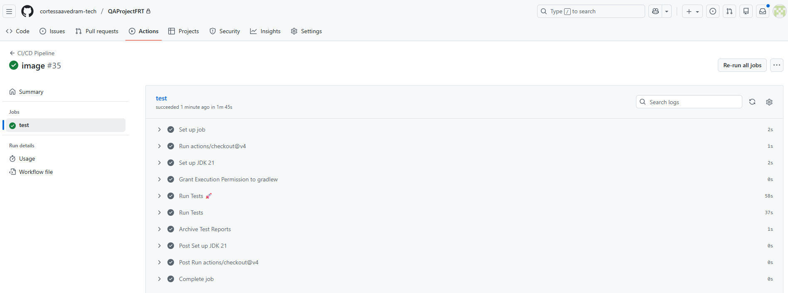

# QA Automation Project - QA Project.-Free Range Testers

## 🚀 Key Achievements and Framework Architecture

This project establishes a robust End-to-End (E2E) testing framework with a Continuous Integration (CI/CD) focus, demonstrating the capability to automate, execute, and report results in cloud environments.

### 1. Technology Stack

| Component          |            Technology            |                        Purpose                    |

| **Language**       |           Java 21                |                 Core of the Automation Framework. |
| **Testing**        |       Cucumber (BDD) & JUnit 5   |    Implementation of business-readable scenarios. |
| **Web Automation** |         Selenium WebDriver       |     Interaction with the browser and UI elements. |
| **Build Tool**     |         Gradle                   |            Dependency management and build tasks. |


### 2. Continuous Integration (CI/CD) Pipeline

A complete workflow was implemented in **GitHub Actions** to guarantee quality with every code push.

* **Autonomous Execution:** Tests run automatically on a Linux runner, utilizing **Headless mode** to optimize performance and stability in the cloud.
* **Barrier Resolution:** Solved complex environment configuration challenges, including managing `JAVA_HOME` settings and correctly assigning execution permissions on the server (`chmod +x gradlew`).

### 2.1. Pipeline Status

The following screenshots demonstrates the successful completion of the job, confirming the correct configuration of environment variables, Gradle execution, and artifact upload.




### 3. TestOps Integration and Traceability

A communication bridge was established between the test code and the test management platform.

* **Qase API Synchronization:** The Qase plugin was configured to upload execution results directly to the TestOps platform via its API.
  
### 3.1. Reporting Evidence (CI/CD Log)

The log below confirms the successful connection and data upload to the platform, demonstrating the complete automation-to-quality management flow:

```bash
[io.qase.commons.reporters.CoreReporter] Starting test run
[io.qase.commons.reporters.CoreReporter] Uploading results
[io.qase.commons.reporters.CoreReporter] Completing test run

### 3.2. Visual Evidence

These screenshots provide visual confirmation of the Qase plugin successfully connecting and processing results:
![Qase Connection Detail 1] (images/1.Qase.png)
![Qase Connection Detail 2] (images/2.Qase.png)

## 4. 📈 Execution Results and BDD Traceability

The framework generates detailed reports that validate business requirements (BDD) and provide clear evidence of the application flows.

### 4.1. Overview of Passed Scenarios

This screenshot from the Cucumber/Gradle HTML report validates that all mapped test cases (identified with `@QaseId=2`) have successfully passed. This confirms the successful end-to-end execution of all user flows.


### 4.2. Data Driven Testing (DDT)

The full report showcases test duration and data validation, confirming the correct functioning of the **Data Driven Testing** approach via Scenario Outlines. This ensures broad coverage with minimal code repetition and high maintenance efficiency.


    
